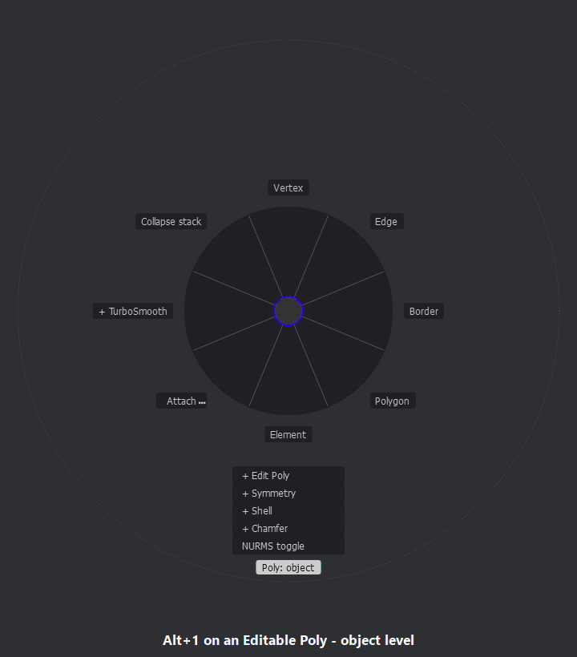
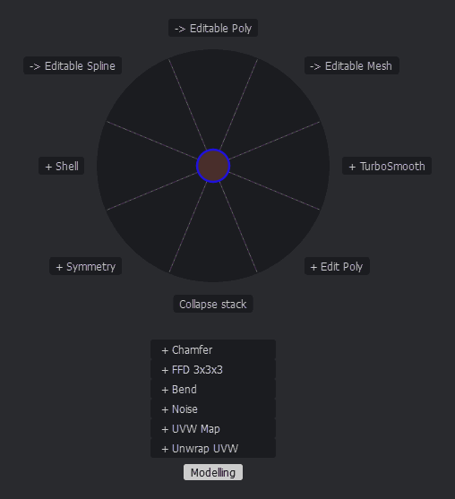
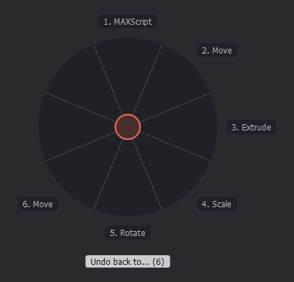
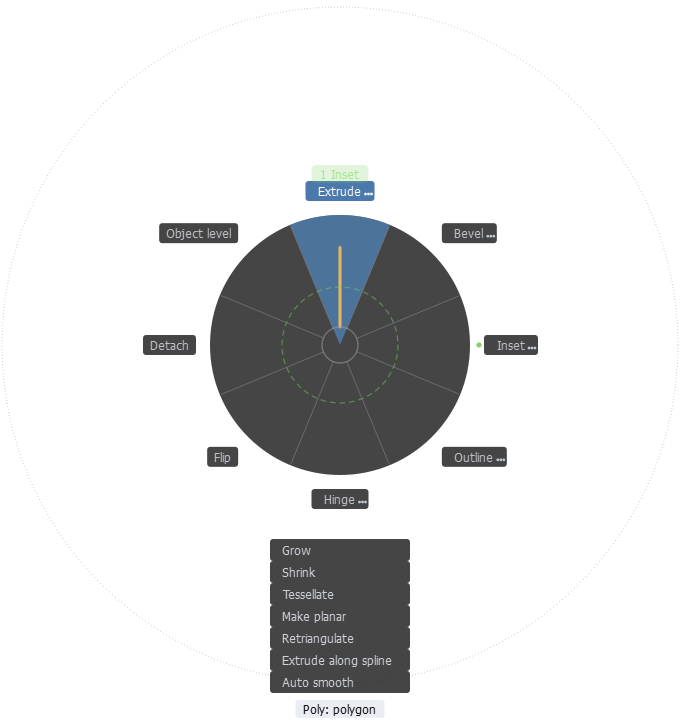
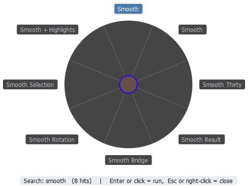
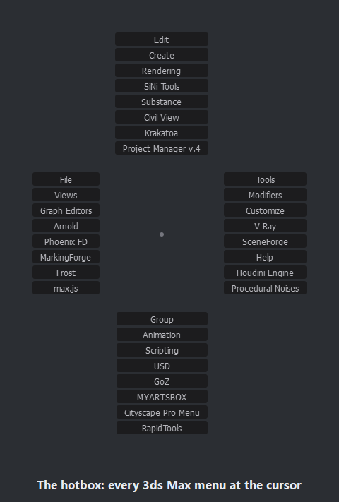
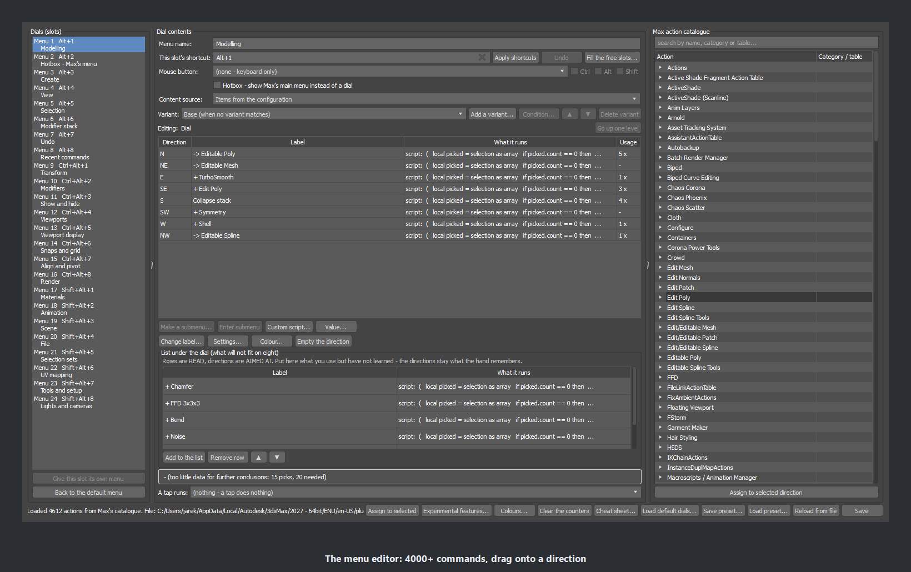

# MarkingForge

**Marking menus for Autodesk 3ds Max 2027.** Hold a key, flick the mouse, done.

MarkingForge brings marking menus - the radial menus Maya users know - to 3ds Max.
Hold a key and a dial of eight commands appears around the cursor; move towards one
and release. Once your hand knows a direction, a quick flick runs the command
without the dial ever being drawn.

This repository holds the **documentation, release notes and the issue tracker**.
The plugin itself is sold separately; there is no source code here.

## Highlights

- 24 ready-made dials on **Alt / Ctrl+Alt / Shift+Alt + 1-8**
- **Context-aware**: vertex, edge, border, polygon or element tools depending on the
  sub-object level - the same layout on Editable Poly and Edit Poly
- **Hotbox** with every 3ds Max menu, including other plugins' menus
- **Live dials**: modifier stack, undo by name, recent commands, selection sets
- **Menu editor** for 4000+ 3ds Max commands, your own scripts, sliders, colours,
  keyboard shortcuts and mouse buttons
- Presets and four ready packs (Modelling, Animation, Look-dev, Archviz)
- Native C++ - about 3 ms to the first pixel. No internet connection, no telemetry

| | |
|---|---|
|  |  |
|  |  |
|  |  |

## Documentation

| Document | What it covers |
|---|---|
| [QuickStart](docs/MarkingForge_QuickStart.pdf) | 17 tutorials and five tricks - start here |
| [Installation and Configuration Guide](docs/MarkingForge_Installation_Guide.pdf) | installing, updating, shortcuts, the 24 dials |
| [Reference](docs/MarkingForge_Reference.pdf) | every option, gesture and command; tips; problems and solutions |
| [Shortcut Card](docs/MarkingForge_Shortcut_Card.pdf) | the 24 dials on one printable page |
| [For Maya Users](docs/MarkingForge_for_Maya_Users.pdf) | Maya habits mapped to MarkingForge |
| [Preset Packs](docs/MarkingForge_Preset_Packs.pdf) | the four ready-made dial sets |
| [Studio Deployment Guide](docs/MarkingForge_Studio_Deployment.pdf) | silent installation for studios |

Release notes: [CHANGELOG.md](CHANGELOG.md)

## Requirements

Autodesk 3ds Max 2027, Windows 10/11 64-bit.

## Reporting a bug or asking for a feature

**[Open an issue](https://github.com/looki666/MarkingForge/issues/new/choose)** and pick a form:

- **Bug report** - something does not work as described.
  In 3ds Max choose **MarkingForge > Report a bug...** first: it copies your 3ds Max and
  MarkingForge details to the clipboard, ready to paste into the form.
- **Feature request** - an idea for a new dial, command or option.
- **Question** - how do I...?

Prefer e-mail? Write to **forgeplugins@gmail.com** - the same address takes bug reports, feature
requests and support questions. Please do not post licence or purchase details in a
public issue; send those by e-mail.

## Author

More plugins by the author: https://www.artstation.com/loki

MarkingForge and its documentation are (c) the author, all rights reserved.
Autodesk and 3ds Max are registered trademarks of Autodesk, Inc. MarkingForge is not
affiliated with or endorsed by Autodesk.
