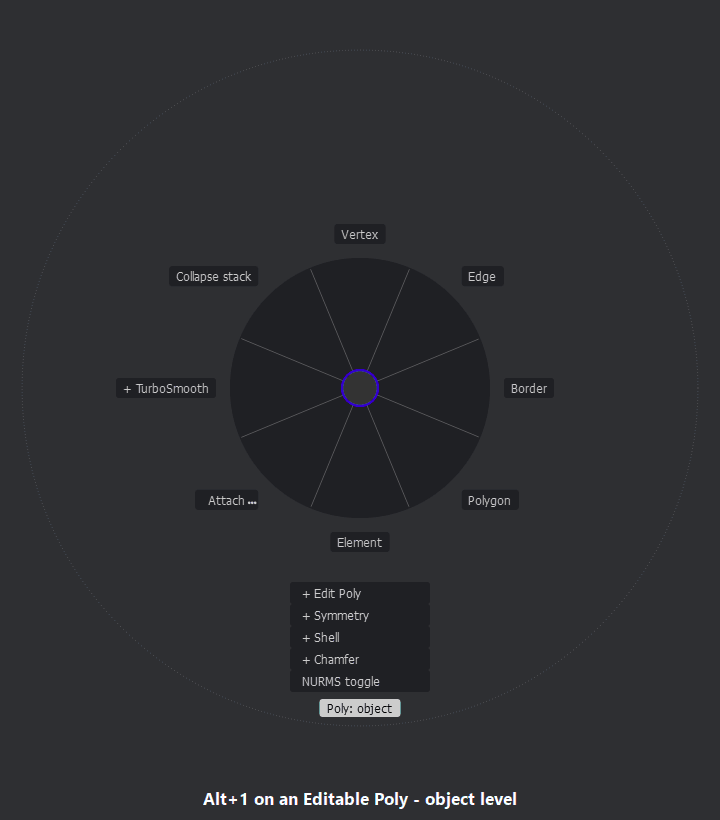
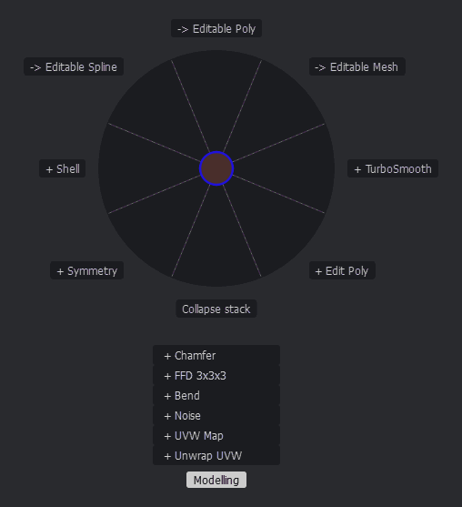
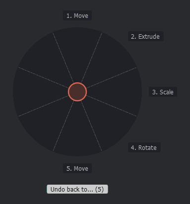
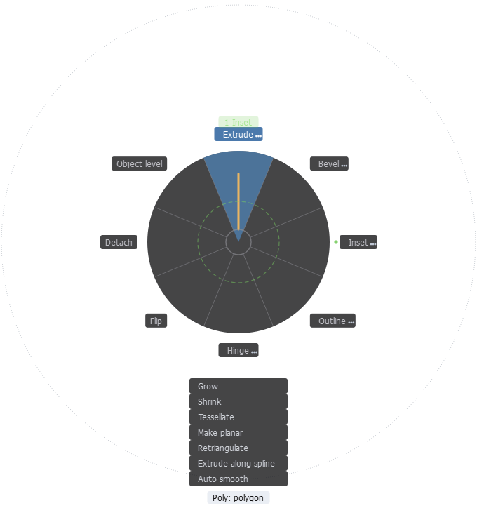
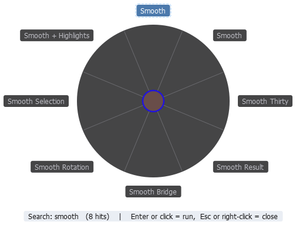
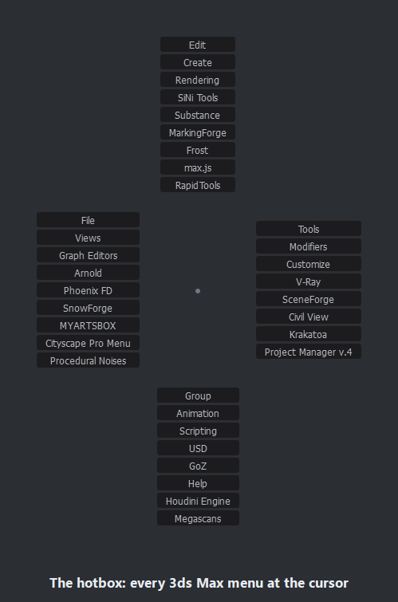
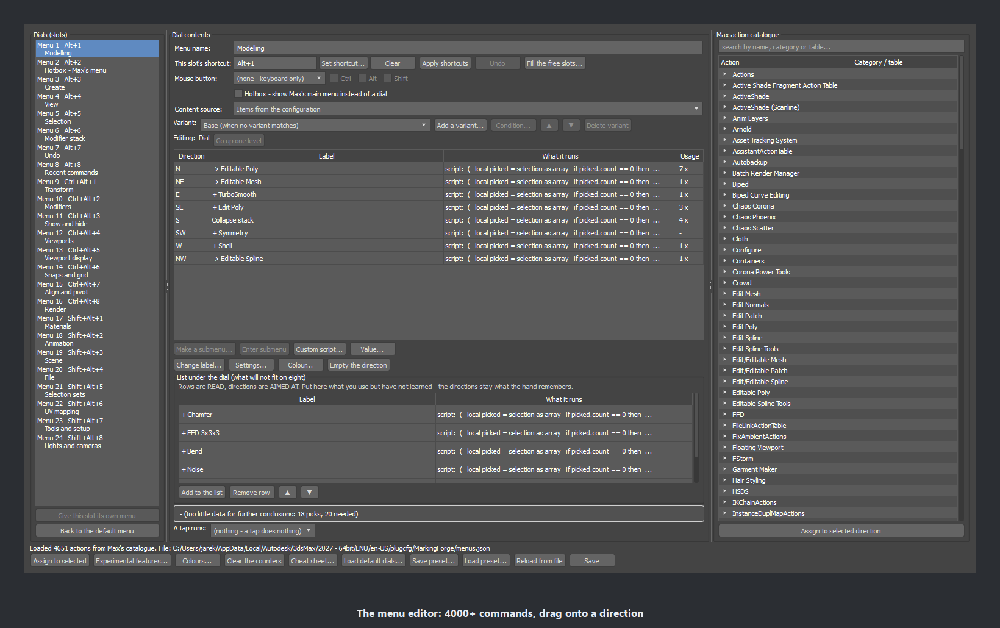

# MarkingForge

**Marking menus for Autodesk 3ds Max 2025-2027.** Hold a key, flick the mouse, done.

> [!IMPORTANT]
> $${\color{red}\textsf{REAL MARKING MENUS - A QUICK GESTURE NEEDS NO DIAL}}$$
>
> The command is chosen by the **direction** of the movement, not by clicking an item.
> Press the key and flick the mouse towards the command in one quick movement - the
> command runs and **the dial is not even drawn**. The dial appears only when you hold
> the key and wait, to remind you where things are.

MarkingForge brings marking menus - the radial menus Maya users know - to 3ds Max.
Hold a key and a dial of eight commands appears around the cursor; move towards one
and release. Once your hand knows a direction, a quick flick runs the command
without the dial ever being drawn.

This repository holds the **documentation, release notes and the issue tracker**.
The plugin itself is sold separately; there is no source code here.

## Highlights

- 24 ready-made dials on **Alt / Ctrl+Alt / Shift+Alt + 1-8**
- **Context-aware**: vertex, edge, border, polygon or element tools depending on the
  sub-object level - the same layout on Editable Poly and Edit Poly
- **The viewport on one key** (Alt+2): shading, lighting, display and views, a page each under
  the mouse wheel - every switch on a direction or in the list under the dial
- **Hotbox** with every 3ds Max menu, including other plugins' menus - one wheel notch away on Alt+2
- **Live dials**: modifier stack, undo by name, recent commands, selection sets
- **Menu editor** for 4000+ 3ds Max commands, your own scripts, sliders, colours,
  keyboard shortcuts and mouse buttons - with a live drawing of the dial, a new-dial
  wizard and ready-made context variants
- **Script library** - 102 ready-made scripts for modelling and everyday work (edge loops
  and rings, chamfer, bridge, bevel, symmetrize, greeble, unwrap, scatter onto a surface,
  arrange and stack, three-point lights, layers by type...), each one tested in 3ds Max
  - onto a dial in one click
- **Submenus** - a whole dial behind one direction (Create: Shapes, Primitives, Helpers,
  Cameras and lights; Modifiers: Deform, Geometry)
- **Sets** - several named contents on one dial (Modelling, UV, Retopo...): pages you
  turn with the mouse wheel while the dial is open, tabs in the editor, and a switch
  from the dial itself or with a key
- **Dial library** - every dial as a file of its own: restore an original in one click,
  or add one of 8 extra dials (mesh cleanup, retopology, pivots, cloning, smoothing,
  quick look, rigging, archviz) and the preset packs' dials
- Keyboard shortcuts ready from the first start, however it was installed
- Presets and four ready packs (Modelling, Animation, Look-dev, Archviz)
- Native C++ - about 3 ms to the first pixel. No internet connection, no telemetry

| | |
|---|---|
|  |  |
|  |  |
|  |  |

### The script library

The script library window, then ten of its scripts run from a dial: before, the dial
aimed at the script, after. [The full video (MP4, 48 s, 1280x720)](images/MarkingForge_script_library_48s.mp4).

## Documentation

| Document | What it covers |
|---|---|
| [QuickStart](docs/MarkingForge_QuickStart.pdf) | 20 tutorials and five tricks - start here |
| [Editor Guide](docs/MarkingForge_Editor_Guide.pdf) | your first dial and every part of the menu editor, step by step |
| [Installation and Configuration Guide](docs/MarkingForge_Installation_Guide.pdf) | installing, updating, shortcuts, the 24 dials |
| [Reference](docs/MarkingForge_Reference.pdf) | every option, gesture and command; tips; problems and solutions |
| [Shortcut Card](docs/MarkingForge_Shortcut_Card.pdf) | the 24 dials on one printable page |
| [For Maya Users](docs/MarkingForge_for_Maya_Users.pdf) | Maya habits mapped to MarkingForge |
| [Preset Packs](docs/MarkingForge_Preset_Packs.pdf) | the four ready-made dial sets |
| [Studio Deployment Guide](docs/MarkingForge_Studio_Deployment.pdf) | silent installation for studios |

Release notes: [CHANGELOG.md](CHANGELOG.md)

## Requirements

Autodesk 3ds Max 2025, 2026 or 2027, Windows 10/11 64-bit. Each 3ds Max version has its own
download; 3ds Max 2024 and earlier may follow if enough users ask for them.

## Reporting a bug or asking for a feature

**[Open an issue](https://github.com/looki666/MarkingForge/issues/new/choose)** and pick a form:

- **Bug report** - something does not work as described.
  In 3ds Max choose **MarkingForge > Report a bug...** first: it copies your 3ds Max and
  MarkingForge details to the clipboard, ready to paste into the form.
- **Feature request** - an idea for a new dial, command or option.
- **Question** - how do I...?

Prefer e-mail? Write to **forgeplugins@gmail.com** - the same address takes bug reports, feature
requests and support questions. Please do not post licence or purchase details in a
public issue; send those by e-mail.

## Author

More plugins by the author: https://forgeplugins.tech

MarkingForge and its documentation are (c) the author, all rights reserved.
Autodesk and 3ds Max are registered trademarks of Autodesk, Inc. MarkingForge is not
affiliated with or endorsed by Autodesk.
